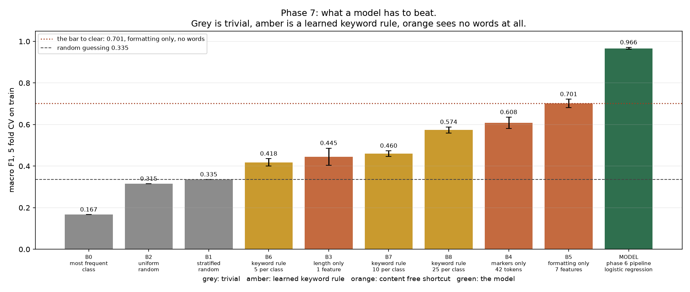
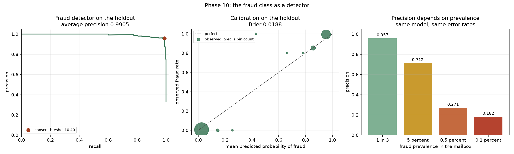
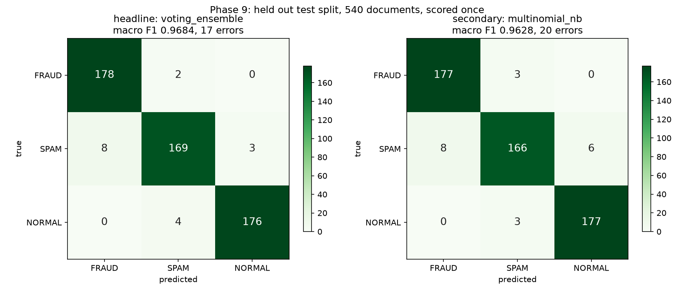

# Fraud Email Classification

Three class text classification separating legitimate business mail, spam, and advance fee
fraud, built as a portfolio piece with the evaluation done honestly rather than
optimistically.

The modelling is deliberately conventional: TF IDF features and classical classifiers, which
is what the task calls for. The work that makes it worth reading is everything around that.
The corpus is assembled from two separate sources, which creates several routes to a high
score that have nothing to do with reading email, and most of this project is the
measurement of those routes.



## What the system does

**Input** is the raw text body of a single email, with no headers, no sender information and
no attachments. **Output** is one of three labels, plus a probability for the fraud class
that can be thresholded when the model is used as a detector rather than a classifier.

The pipeline, in order:

<table>
<tr><th>Stage</th><th>What happens</th></tr>
<tr><td>1. Canonical normalisation</td><td>lowercase; strip quoted printable remnants and Unicode replacement characters; mask runs of digits to a single token; map the currency, at and percent signs to word tokens so they survive; drop remaining punctuation; collapse whitespace</td></tr>
<tr><td>2. Provenance stripping</td><td>delete 42 curated tokens that name the source organisation, its employees, its city and phone fragments, its mail header furniture, and the two tools used to collect the spam</td></tr>
<tr><td>3. Stopword removal</td><td>the NLTK English list, 186 words</td></tr>
<tr><td>4. Lemmatisation</td><td>WordNet, verb form first and noun form only as a fallback behind a minimum length guard</td></tr>
<tr><td>5. Vectorisation</td><td>TF IDF over unigrams and bigrams, minimum document frequency 2, sublinear term frequency scaling</td></tr>
<tr><td>6. Classification</td><td>soft voting ensemble averaging multinomial naive Bayes, logistic regression and a random forest</td></tr>
<tr><td>7. Decision</td><td>argmax over the three classes for the label; a 0.40 threshold on the fraud probability when used as a detector</td></tr>
</table>

Stages 1 through 6 are scikit learn transformers assembled into a single `Pipeline`, so the
vectoriser vocabulary and document frequencies are fitted on training folds only and never
see the data they are scored against. Stages 1 through 4 hold no learned state, which a test
asserts directly by fitting on unrelated text and confirming the output does not change.

Why each stage is there, and what it costs, is in the Method section below. The short version
is that stages 1 and 2 exist to close measurable leaks, stages 3 and 4 change nothing
measurable and are kept only because they halve the feature space, and stage 7 barely matters
because the detector already sits against the corner of its precision recall curve.

## Result

Held out test split of 540 documents, untouched from the moment it was created until the
single evaluation that produced this number.

<table>
<tr><th>What</th><th>Macro F1</th></tr>
<tr><td><b>Soft voting ensemble on TF IDF features</b></td><td><b>0.9684</b></td></tr>
<tr><td>95 percent bootstrap interval on that score</td><td>0.9526 to 0.9819</td></tr>
<tr><td>Multinomial naive Bayes, the simpler alternative</td><td>0.9628</td></tr>
<tr><td colspan="2"></td></tr>
<tr><td>Formatting only, seven numeric features and no words at all</td><td>0.7013</td></tr>
<tr><td>Provenance markers only, 42 tokens and no content</td><td>0.6082</td></tr>
<tr><td>A learned keyword rule, 75 words total</td><td>0.5737</td></tr>
<tr><td>Document length only, one feature</td><td>0.4453</td></tr>
<tr><td>Random guessing</td><td>0.3355</td></tr>
<tr><td>Always predicting one class</td><td>0.1667</td></tr>
</table>

Those lower rows are the point of the table. **A classifier given nothing but seven
statistics about how a message is formatted reaches 0.7013**, without seeing a single word.
Any headline accuracy on this corpus has to be read against that, not against the 0.1667 or
0.3355 floors, and a score reported with no baselines at all is uninterpretable.

Per class, and by consequence:

<table>
<tr><th>Class</th><th>Precision</th><th>Recall</th><th>F1</th></tr>
<tr><td>FRAUD</td><td>0.9570</td><td>0.9889</td><td>0.9727</td></tr>
<tr><td>SPAM</td><td>0.9657</td><td>0.9389</td><td>0.9521</td></tr>
<tr><td>NORMAL</td><td>0.9832</td><td>0.9778</td><td>0.9805</td></tr>
</table>

<table>
<tr><th>Failure mode</th><th>Count in 540</th></tr>
<tr><td><b>Fraud reaching the inbox, filed as legitimate mail</b></td><td><b>0</b></td></tr>
<tr><td><b>Legitimate mail destroyed, filed as fraud</b></td><td><b>0</b></td></tr>
<tr><td>Fraud caught but misfiled as spam</td><td>2</td></tr>
<tr><td>Legitimate mail misfiled as spam</td><td>4</td></tr>
<tr><td>Spam misfiled</td><td>11</td></tr>
<tr><td><i>total errors</i></td><td><i>17</i></td></tr>
</table>

Macro F1 weights every error equally. In use they are not equal: a fraud email filed as spam
still leaves the inbox and the user is still protected, while one filed as legitimate does
not. The claim worth making about this model is not its macro F1. It is that **no fraud
email reached the inbox and no legitimate email was destroyed, in 360 opportunities.**

## Three findings worth your time

### 1. A leak that agrees with the true signal is invisible to holdout validation

Three shortcuts exist in this corpus, each measured by giving a classifier one artifact and
no access to content:

<table>
<tr><th>Shortcut</th><th>Macro F1</th><th>Where it comes from</th></tr>
<tr><td>Formatting</td><td>0.7013</td><td>the two sources were preprocessed differently, so casing and punctuation spacing identify the file</td></tr>
<tr><td>Named entities</td><td>0.6082</td><td>the legitimate mail is real Enron correspondence, so the company name is a class label</td></tr>
<tr><td>Length</td><td>0.4453</td><td>fraud runs 4.35 times the median length of spam</td></tr>
</table>

Removing all of them costs **0.0014 macro F1**, less than the fold to fold noise. So the
leaks are redundant with the content rather than additive to it, and a conventional
evaluation would never notice them.

But a model given the shortcuts does use them. Fitting with them available and then scoring
on input where they have been removed drops macro F1 by 0.0078. Nothing in a train and test
split penalises that, because the leak and the genuine signal agree on this corpus, so a
holdout drawn from the same corpus cannot detect the dependence. Only an ablation can.

That is the transferable lesson and it is worth more than the score. A model trained on the
raw corpus has a route to seventy percent of this task without reading a word, and the first
time it meets mail from a different company, preprocessed by a different pipeline, that route
disappears.

### 2. More than half the model's errors are the model being right

All seventeen holdout errors were read individually and adjudicated, with the verdicts
recorded in the code so a reader can disagree with any one of them.

<table>
<tr><th>Verdict</th><th>Count</th><th>Share</th></tr>
<tr><td><b>Corpus label wrong, model right</b></td><td><b>10</b></td><td>58.8 percent</td></tr>
<tr><td>Model wrong</td><td>5</td><td>29.4 percent</td></tr>
<tr><td>Arguable either way</td><td>2</td><td>11.8 percent</td></tr>
</table>

Every one of the ten is an advance fee scam that lives in the Enron spam corpus and is
therefore labelled SPAM. The model reads it as FRAUD and is marked wrong for doing so:

```
[labelled SPAM, predicted FRAUD]
  "investment offer from joseph otisa ... the branch manager of allstates
   trust bank of nigeria plc lagos state branch"

[labelled SPAM, predicted FRAUD]
  "request for assistance barrister adewale coker chambers legal
   practitioners / notary public ... lagos nigeria"

[labelled SPAM, predicted NORMAL]
  "out of office autoreply : i am on vacation week 29 + 30 + 31"
```

If those labels were corrected, errors would fall from seventeen to five plus two arguable,
which puts the corpus ceiling near 0.99 and means the difference between the top models in
the sweep is **smaller than the label noise they were ranked on.**

This is recorded as an indication of the ceiling and not as a score. The headline stays
0.9684 exactly as measured, and no model or threshold was chosen using the adjudication.

The three of five genuine errors that are most instructive are all legitimate business mail
carrying one strong spam term: a bond reference containing `mortgage`, an internship
containing `offer`, a software trial that reads as marketing. That is the failure mode of a
bag of words model, and it argues for phrase level features rather than for more
hyperparameter search.

### 3. Precision from a balanced benchmark does not survive contact with a real mailbox

The corpus is one third fraud by construction. Recall and the false alarm rates are
properties of the classifier and transfer; the class proportions are not, and precision
depends on them. Per 100,000 messages, at identical recall of 0.9889:

<table>
<tr><th>Mailbox</th><th>Precision</th><th>False alarms from spam</th><th>False alarms from legitimate mail</th></tr>
<tr><td>Corpus as built, 1 in 3 fraud</td><td>0.9570</td><td>1,481</td><td>0</td></tr>
<tr><td>Spam heavy inbox, 5 percent fraud</td><td>0.7120</td><td>2,000</td><td>0</td></tr>
<tr><td>Filtered inbox, 0.5 percent fraud</td><td>0.2705</td><td>1,333</td><td>0</td></tr>
<tr><td>Well filtered inbox, 0.1 percent fraud</td><td>0.1820</td><td>444</td><td>0</td></tr>
</table>

**Precision falls by a factor of five with nothing about the model changed.** Every
tutorial figure quoted from a balanced corpus should be read this way.

The second column matters as much as the first, though. Every false alarm comes from spam and
none from legitimate mail, because the measured false alarm rate on legitimate mail is zero.
So what the collapse describes is a detector filing junk as the wrong kind of junk, which in
a triage system where both fraud and spam leave the inbox costs almost nothing. Quoting 0.957
without the correction is misleading. Quoting 0.182 without saying where the false alarms
land is misleading in the other direction.



## The data

One download, no account required, scripted rather than committed. Source and full provenance
in [docs/sources.md](docs/sources.md).

<table>
<tr><th>Source</th><th>What it is</th><th>Supplies</th></tr>
<tr><td><code>fradulent_emails.txt</code></td><td>CLAIR collection of advance fee fraud emails, a concatenated mailbox</td><td>FRAUD</td></tr>
<tr><td><code>spam_normal_emails.csv</code></td><td>Enron derived corpus, 5,728 rows</td><td>SPAM and NORMAL</td></tr>
</table>

Building a usable corpus from those took three phases, and the numbers are not the ones in
circulation:

* The fraud mailbox holds **3,978** messages, not the 4,075 the reference claims or the 3,977
  usually cited. Two envelope lines lack the prefix most code splits on, so the common figure
  of 3,976 silently loses two messages and corrupts two more.
* **28.7 percent** of the combined pool is near duplicate. Fraud is worst at 38.4 percent,
  because advance fee campaigns are sent from templates with names and figures swapped.
* A balanced 1,000 per class, which the reference uses, is **unreachable** after honest
  deduplication. The spam pool yields 994 usable clusters. This corpus is 900 per class.
* Five clusters carry contradictory labels, all FRAUD against SPAM, because the same
  campaigns reached Enron employees and both corpora collected them. Dropped rather than
  majority voted.

Final corpus: 2,700 documents, 900 per class, split 2,160 train and 540 test. Sampling takes
one document per near duplicate cluster, so the corpus contains no duplicates at all and none
can straddle the split. The build asserts that rather than assuming it.

## Method

<table>
<tr><th>Step</th><th>Choice</th><th>Why</th></tr>
<tr><td>Text normalisation</td><td>lowercase, strip MIME and decode artifacts, mask numbers, keep currency and at signs as words</td><td>collapses the two source preprocessing styles into one, which closes the formatting shortcut</td></tr>
<tr><td>Provenance stripping</td><td>42 curated tokens naming the company, its people, its location, and the tools that collected the spam</td><td>removes a 0.6082 shortcut at a cost of 0.0014</td></tr>
<tr><td>Stopwords and lemmatisation</td><td>both applied</td><td>they change nothing measurable; kept because they remove 15.5 percent of the vocabulary and 43 percent of the tokens at no cost</td></tr>
<tr><td>Features</td><td>TF IDF, unigrams and bigrams, minimum document frequency 2</td><td>beat raw counts for every model except random forest</td></tr>
<tr><td>Model</td><td>soft voting ensemble over naive Bayes, logistic regression and random forest</td><td>won a fourteen configuration sweep, though see the honest note below</td></tr>
<tr><td>Scoring</td><td>nested cross validation, outer five folds and inner three</td><td>so no reported number was tuned on the data it reports</td></tr>
<tr><td>Threshold</td><td>0.40, selected on training folds under stated costs</td><td>barely matters, and the same value is chosen across a fifty fold range of cost ratios</td></tr>
</table>

Every preprocessing step lives inside a scikit learn `Pipeline`, so the vectoriser is fitted
on training folds only. Every seed is fixed at 20260914. Every phase writes a machine
readable report, so any number above can be traced to the run that produced it.

### The honest note on the model choice

The ensemble won at 0.9740 nested macro F1. Multinomial naive Bayes scored 0.9721, which is
inside the standard deviation of 0.0027, at a sixth of the compute and with coefficients you
can read. **Naive Bayes is the defensible recommendation for this problem.** The ensemble is
reported as the headline only because it was selected before the holdout was read, and
switching afterwards would have been selection on the test set.



## What did not work

Negative results, kept because they took as long as the positive ones and because a project
that reports only what worked is not reporting.

<table>
<tr><th>Expectation</th><th>Measured</th></tr>
<tr><td>Removing the provenance leaks would drop the score substantially, and that gap would be the headline</td><td>It costs 0.0014, below the fold noise. The leaks are redundant with the content, not additive.</td></tr>
<tr><td>Stopword removal and lemmatisation would improve the model</td><td>Nine preprocessing conditions span 0.0042 against a fold standard deviation of 0.0049. Nothing is distinguishable.</td></tr>
<tr><td>Holding first person pronouns back from the stopword list would help, since advance fee fraud is written as "I am Mrs X, my late husband"</td><td>0.9657 with the exemption against 0.9676 without it. No evidence, and the direction is opposite to the prediction.</td></tr>
<tr><td>Tuning the decision threshold would matter for a fraud detector</td><td>0.40 against a default of 0.50, worth 3.5 cost units out of 150. Average precision is 0.9905 and the curve sits against the corner.</td></tr>
<tr><td>The spam misspelling family, <code>shlpplng</code> and <code>oniine</code> and friends, would be doing disproportionate work</td><td>Removing all of them costs 0.0019, inside the bootstrap interval.</td></tr>
<tr><td>Tuning hyperparameters on the scoring folds would inflate the estimate noticeably</td><td>+0.0007 on average and +0.0033 at worst. Small grids on a strong signal, but you cannot know that without measuring it.</td></tr>
<tr><td>Every Normal and Spam body would open with <code>Subject:</code>, giving a one token leak</td><td>True of the source files, but the reference author had already stripped it. Hypothesis withdrawn.</td></tr>
</table>

Seven of the twenty two defects logged in [docs/data_defects.md](docs/data_defects.md) were
in our own method rather than the data. Among them: single linkage clustering chaining
unrelated documents through shared boilerplate, a lemmatiser turning `mrs` into `mr` and
destroying a term with 96 percent fraud purity, a leakage check that could not fail and hid
eight real leaks, an optimism measurement that produced a negative number because two
effects cancelled, and a holdout comparison made against a standard deviation eleven times
too narrow.

## Limitations

* **The corpus is old.** The CLAIR collection predates the rise of phishing, and the single
  genuine fraud the model missed is a bank phishing alert. This project cannot say how the
  approach behaves on modern credential harvesting or business email compromise.
* **The legitimate class is one company.** Every NORMAL document is Enron correspondence
  from around 2000. The provenance audit removes the obvious identifiers, but a class defined
  by one organisation's mail cannot be assumed to generalise.
* **Label noise is material.** 58.8 percent of the holdout errors are label disagreements
  between the two sources. That caps what any model can score and it makes fine grained model
  comparison on this corpus unreliable.
* **Balanced by construction.** Every score is measured at one third fraud prevalence. The
  projection table above is the correction, and it depends on assumed prevalences rather than
  measured ones.
* **English, plain text bodies only.** No headers, no attachments, no sender reputation, no
  URL analysis, all of which a production system would use and several of which would
  probably matter more than the classifier.

## Reproducing this

Full environment setup in [docs/SETUP.md](docs/SETUP.md). Homebrew Python 3.12, local
virtual environment, no accounts or API keys.

```bash
/opt/homebrew/opt/python@3.12/bin/python3.12 -m venv .venv && source .venv/bin/activate && pip install -r requirements.txt
```

```bash
source .venv/bin/activate && python -c "import nltk; [nltk.download(p) for p in ('stopwords','punkt','punkt_tab','wordnet','omw-1.4')]"
```

```bash
source .venv/bin/activate && python scripts/download_data.py && python scripts/parse_fraud.py && python scripts/build_dataset.py
```

```bash
source .venv/bin/activate && python scripts/run_model_sweep.py && python scripts/evaluate_holdout.py
```

```bash
source .venv/bin/activate && python -m pytest -q
```

235 tests. They cover the analysis, not just the plumbing: that both source formatting styles
collapse to identical normalised text, that complete linkage refuses to chain, that no
blocklisted token is an ordinary English word, that the lemmatiser produces real words, that
precision falls with prevalence while recall does not, and that the holdout ledger records
exactly two scored configurations.

That last one is worth explaining. The test split was scored once, and
[docs/holdout_ledger.json](docs/holdout_ledger.json) records every evaluation with a
fingerprint of its configuration. It currently holds fourteen entries across **two** distinct
configurations, both chosen before the split was read, with every rerun of a fingerprint
recording a byte identical score. A third configuration appearing there would mean something
was selected using the test data, and it would be visible in the repository rather than
resting on my assurance. That is the mechanism that makes the single holdout claim checkable
instead of merely stated.

## Repository layout

<table>
<tr><th>Path</th><th>Contents</th></tr>
<tr><td><a href="PLAN.md">PLAN.md</a></td><td>the plan written before any code, with the inherited defects section and the evaluation protocol fixed in advance</td></tr>
<tr><td><a href="WALKTHROUGH.md">WALKTHROUGH.md</a></td><td>how it was built, in order, with the wrong turns left in</td></tr>
<tr><td><a href="docs/data_defects.md">docs/data_defects.md</a></td><td>all twenty two defects, what was measured, and what was decided</td></tr>
<tr><td><code>docs/phase*_findings.md</code></td><td>per phase write ups with the full tables</td></tr>
<tr><td><code>docs/phase*.json</code></td><td>machine readable results behind every number quoted here</td></tr>
<tr><td><code>src/</code></td><td>importable modules: corpus building, normalisation, provenance markers, preprocessing, baselines, evaluation, thresholds</td></tr>
<tr><td><code>scripts/</code></td><td>one entry point per phase, each runnable on its own</td></tr>
<tr><td><code>tests/</code></td><td>235 tests</td></tr>
<tr><td><code>reports/figures/</code></td><td>the figures in this README</td></tr>
</table>

## Attribution

The task specification and the corpus construction come from the public repository
[`SimarjotKaur/Email-Classifier`](https://github.com/SimarjotKaur/Email-Classifier), which
assembles this three class corpus and compares SVM, KNN, naive Bayes, decision trees,
logistic regression and ensemble methods across CountVectorizer and TF IDF features. That
repository is the starting point and is credited throughout.

This project is not a copy of it. It reuses the corpus construction and repairs the
evaluation: deduplication before sampling, a fixed and recorded seed, vectorisers fitted
inside folds, nested cross validation, a baseline suite, the provenance audit, and a single
holdout evaluation with a ledger. The defects inherited and repaired are enumerated in
section 8 of [PLAN.md](PLAN.md) and tracked through
[docs/data_defects.md](docs/data_defects.md).

Underlying corpora: the CLAIR fraud collection published by Rachael Tatman, and the Enron
derived spam corpus, both cited with links in [docs/sources.md](docs/sources.md). No email
content is redistributed here; `data/` is git ignored and the download is scripted.
